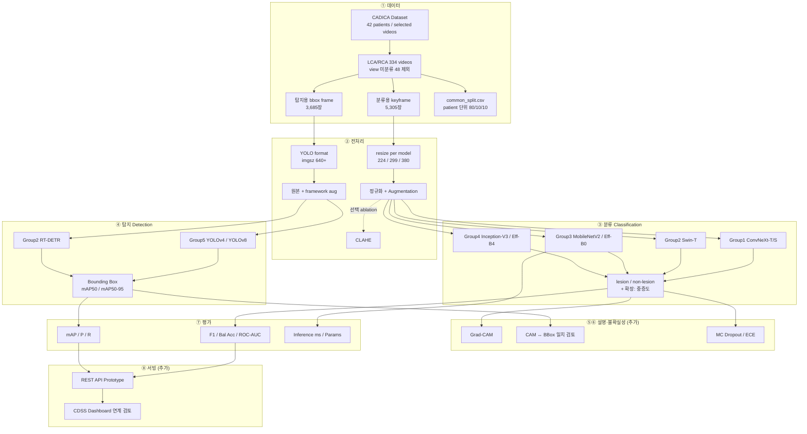
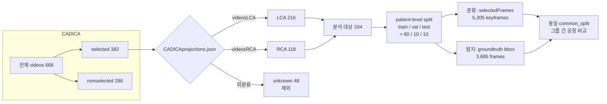
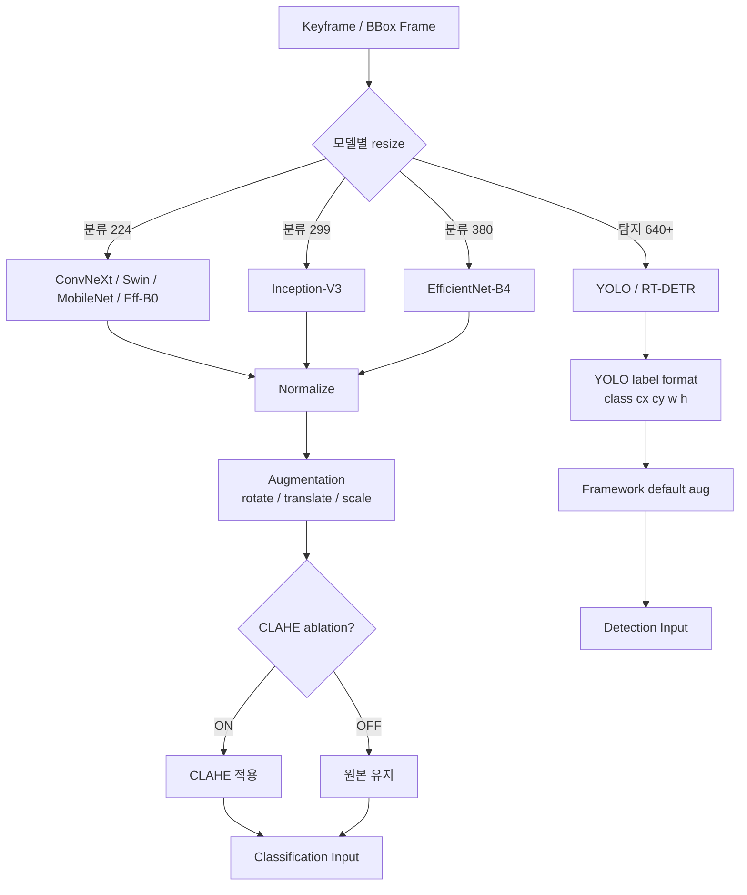
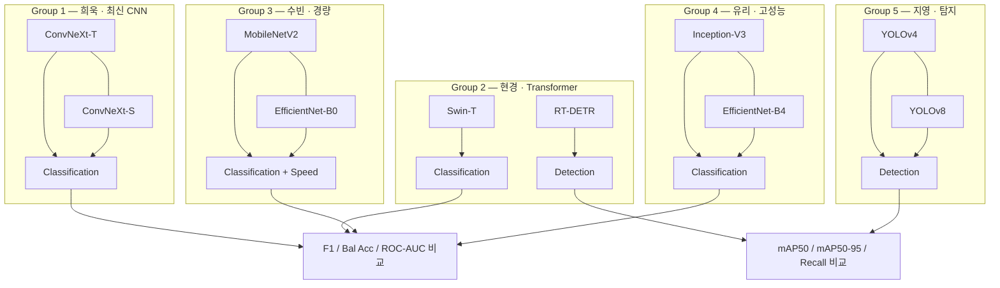
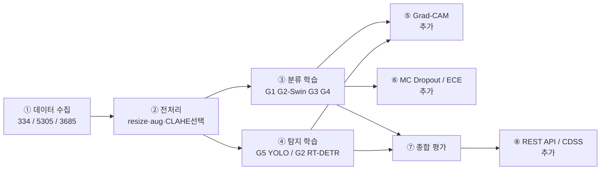
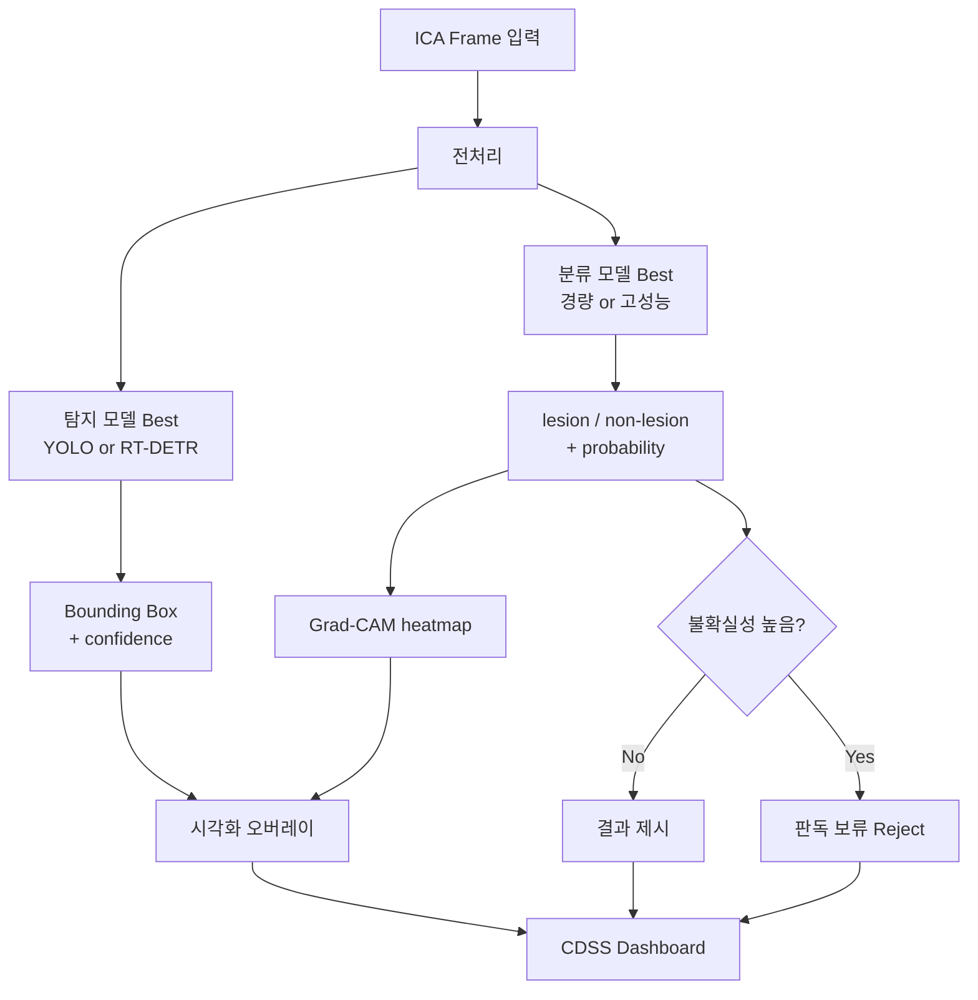
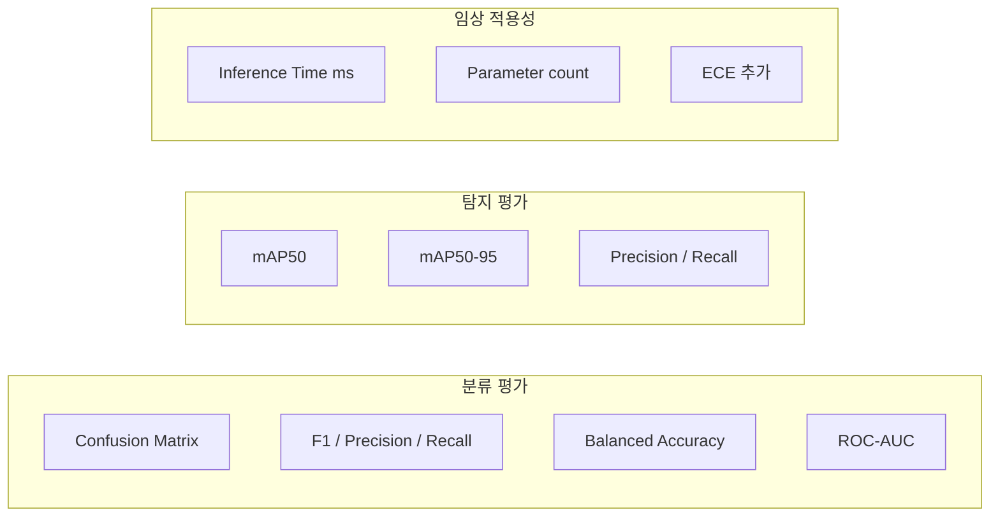

# CADICA 협착 탐지·분류 — 아키텍처 & 흐름도

> 근거: (2팀)연구계획서(수정완료)  
> 과제: 설명가능한 딥러닝 기반 관상동맥 혈관조영술 협착 탐지 및 중증도 분류

---

## 1. 전체 시스템 아키텍처 (한눈에)

---

## 2. 데이터 수집·분할 흐름도

---

## 3. 전처리 분기 흐름도

---

## 4. 그룹별 아키텍처 맵

---

## 5. 학습·평가 파이프라인 (실험 흐름)

---

## 6. 추론 시 임상 보조 흐름 (목표 아키텍처)

---

## 7. 평가 지표 구조

---

## 8. 연구가설 ↔ 실험 매핑

| 가설 | 비교 대상 | 핵심 지표 |
|------|-----------|-----------|
| H1 탐지 고도화 | YOLOv4 vs YOLOv8 vs RT-DETR | mAP50, mAP50-95, Recall |
| H2 성능–속도 트레이드오프 | G3(경량) vs G4(고성능) + ConvNeXt/Swin | F1, Bal Acc, ms, params |
| H3 불확실성 제어 | MC Dropout ×20 | ECE, Reject 가능성 |

---

## 사용 팁

- GitHub / Notion / Obsidian: Mermaid 그대로 렌더링  
- PPT: [mermaid.live](https://mermaid.live)에 붙여넣어 PNG/SVG보내기  
- 발표: **다이어그램 1(전체)** + **다이어그램 4(그룹)** + **다이어그램 6(추론)** 세 장이면 충분  
