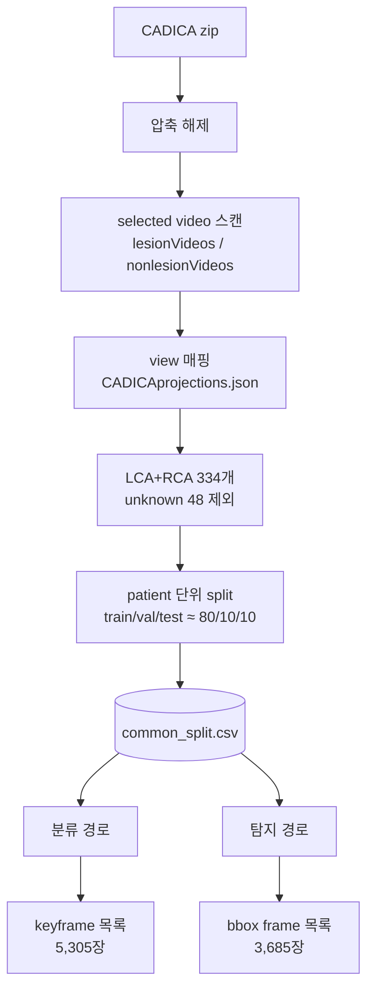
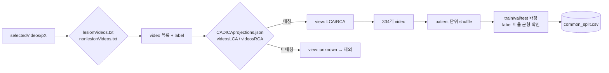
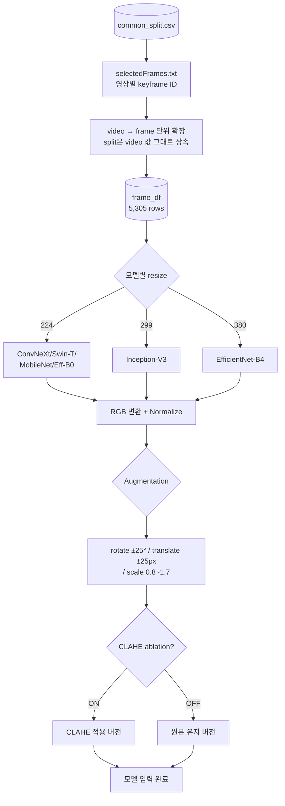
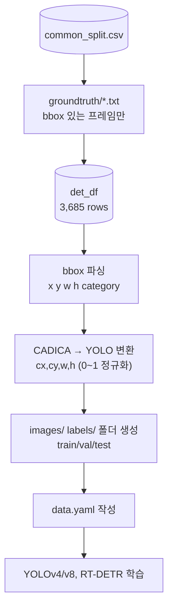
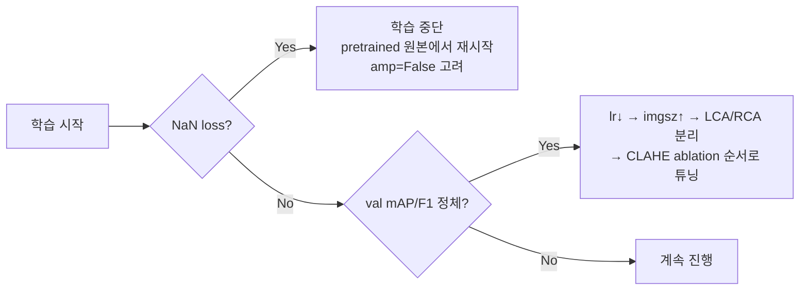

# CADICA 전처리 파이프라인

> 팀 공통 전처리 + 그룹별(분류/탐지) 분기 파이프라인 정리
> 관련 문서: `연구_아키텍처_흐름도.md`

---

## 0. 전체 그림



---

## 1. 공통 단계 — `common_split.csv` 생성

**한 번만 만들고 팀 전체가 공유. 이후 아무도 재분할하지 않음.**



### 핵심 코드

```python
# 1) video 단위 label 수집
rows = []
for p_dir in sorted(base.glob("p*")):
    lesion_vids = (p_dir/"lesionVideos.txt").read_text().split() if (p_dir/"lesionVideos.txt").exists() else []
    nonlesion_vids = (p_dir/"nonlesionVideos.txt").read_text().split() if (p_dir/"nonlesionVideos.txt").exists() else []
    for v in lesion_vids:    rows.append({"patient_id": p_dir.name, "video_id": v, "label": "lesion"})
    for v in nonlesion_vids: rows.append({"patient_id": p_dir.name, "video_id": v, "label": "non-lesion"})
df = pd.DataFrame(rows)

# 2) view 매핑 (LCA/RCA), unknown 제외
lca_set = set(projections["videosLCA"])
rca_set = set(projections["videosRCA"])
df["view"] = df.apply(lambda r: "LCA" if f"{r.patient_id}_{r.video_id}" in lca_set
                              else "RCA" if f"{r.patient_id}_{r.video_id}" in rca_set
                              else "unknown", axis=1)
df_final = df[df.view != "unknown"].reset_index(drop=True)   # 334개

# 3) patient 단위 split (label 비율 맞는 seed 탐색)
# best_seed 탐색 로직으로 train/val/test 배정 (≈80/10/10, label 비율 균형)
df_final["split"] = assign_split_with_best_seed(df_final)

# 4) 저장
df_final.to_csv("common_split.csv", index=False)
```

### 체크리스트
- [ ] LCA 216 / RCA 118 = 334개 확인
- [ ] train/val/test 각 split의 `non-lesion` 비율이 전체 비율(≈26%)과 비슷한지
- [ ] `patient_id` 기준으로 train/val/test 간 중복 없는지

---

## 2. 분류(Classification) 경로

**대상: Group 1(ConvNeXt), Group 2(Swin-T), Group 3(MobileNet/Eff-B0), Group 4(Inception/Eff-B4)**



### 핵심 코드

```python
def get_selected_frames(patient_id, video_id):
    sf_files = list((base/patient_id/video_id).glob("*selectedFrames.txt"))
    if not sf_files: return []
    return [l.strip() for l in sf_files[0].read_text().splitlines() if l.strip()]

# video 단위 df → frame 단위로 확장 (split은 그대로 상속)
rows = []
for _, r in df.iterrows():
    for fid in get_selected_frames(r.patient_id, r.video_id):
        fid_clean = fid.zfill(5) if fid.isdigit() else fid
        frame_name = f"{r.patient_id}_{r.video_id}_{fid_clean}"
        rows.append({..., "frame_path": ..., "split": r.split, "label": r.label})
frame_df = pd.DataFrame(rows)
```

```python
# 모델별 resize + 표준 augmentation (예: torchvision / tf.keras 공통 로직)
def preprocess_classification(img_path, size, use_clahe=False):
    img = cv2.imread(str(img_path))
    img = cv2.cvtColor(img, cv2.COLOR_BGR2RGB)
    if use_clahe:
        gray = cv2.cvtColor(img, cv2.COLOR_RGB2GRAY)
        gray = cv2.createCLAHE(clipLimit=3.0, tileGridSize=(8,8)).apply(gray)
        img = cv2.cvtColor(gray, cv2.COLOR_GRAY2RGB)
    img = cv2.resize(img, (size, size))
    img = img.astype(np.float32) / 255.0
    return img
```

### 모델별 resize 표

| 모델 | size |
|------|------|
| ConvNeXt-T/S, Swin-T, MobileNetV2, EfficientNet-B0 | 224 |
| Inception-V3 | 299 |
| EfficientNet-B4 | 380 |

---

## 3. 탐지(Detection) 경로

**대상: Group 5(YOLOv4/v8), Group 2(RT-DETR)**



### 핵심 코드

```python
# bbox 있는 프레임만 필터
det_df = []  # (patient_id, video_id, frame_id, img_path, bbox_path, split, view)
for _, r in df.iterrows():
    gt_dir = base/r.patient_id/r.video_id/"groundtruth"
    if not gt_dir.exists(): continue
    for gt_file in sorted(gt_dir.glob("*.txt")):
        det_df.append({..., "split": r.split})

# CADICA bbox -> YOLO 포맷
def cadica_to_yolo(x, y, w, h, img_w, img_h):
    cx = (x + w/2) / img_w
    cy = (y + h/2) / img_h
    return cx, cy, w/img_w, h/img_h

# images/labels/{split} 폴더 + symlink
for split in ["train","val","test"]:
    (YOLO_ROOT/"images"/split).mkdir(parents=True, exist_ok=True)
    (YOLO_ROOT/"labels"/split).mkdir(parents=True, exist_ok=True)

def process_one_frame(row):
    img_w, img_h = get_image_size_fast(row.img_path)
    boxes = parse_bbox_file(row.bbox_path)
    lines = [f"0 {cx:.6f} {cy:.6f} {w:.6f} {h:.6f}"
             for b in boxes
             for cx,cy,w,h in [cadica_to_yolo(b["x"],b["y"],b["w"],b["h"],img_w,img_h)]]
    (YOLO_ROOT/"labels"/row.split/f"{row.frame_id}.txt").write_text("\n".join(lines))
    os.symlink(Path(row.img_path).resolve(), YOLO_ROOT/"images"/row.split/f"{row.frame_id}.png")
```

```yaml
# data.yaml
path: /content/cadica_yolo
train: images/train
val: images/val
test: images/test
nc: 1
names: ['lesion']
```

---

## 4. 전처리 요약 비교표

| 구분 | 대상 | 프레임 소스 | 입력 형식 | 필수 전처리 | 선택 전처리 |
|------|------|-------------|-----------|--------------|--------------|
| 분류 | Group 1/2(Swin)/3/4 | `selectedFrames.txt` | 224~380 정사각 RGB | resize, normalize, aug | CLAHE(ablation) |
| 탐지 | Group 5, Group 2(RT-DETR) | `groundtruth/*.txt` | 640+ YOLO format | bbox 변환, images/labels 구조 | CLAHE(ablation, 후순위) |

---

## 5. 안전장치 체크리스트 (실험 중 문제 방지)



- bbox `w`/`h` 0 이하 여부 사전 검사
- `images`/`labels` 파일 개수 split별 일치 여부
- patient 단위 split 재사용 (그룹별로 다시 나누지 않기)
- CLAHE/Frangi 등은 **분류·탐지 baseline이 잡힌 뒤 ablation으로만** 추가

---

## 6. 사용 팁

- 이 문서는 팀 공용 전처리 로직의 **단일 기준**으로 사용
- 각 그룹은 3번 섹션(모델별 resize 표) 값만 자신의 모델에 맞게 바꿔서 사용
- CLAHE, Frangi 등 추가 필터는 baseline 완료 후 **A/B 비교 실험**으로만 추가
